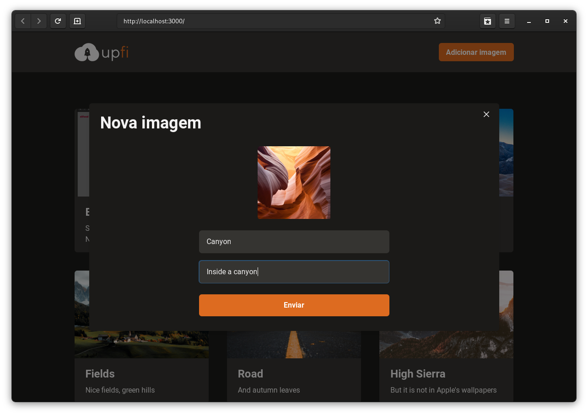
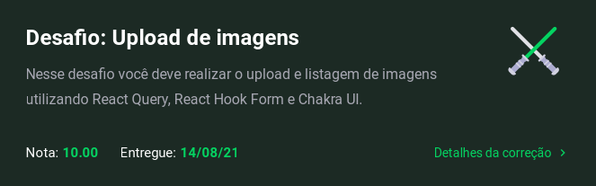

<h1 align="center">upfi (ignite challenge)</h1>

#### Ignite

## Sobre o desafio

O desafio consistiu em completar a implementação de um serviço de upload de imagens, usando [Chakra UI](https://chakra-ui.com), [React Query](https://react-hook-form.com/), [React Hook Form](https://react-query.tanstack.com/) e Next.js. Para o upload de imagens foi usada a API do [ImgBB](https://imgbb.com) e [FaunaDB](https://fauna.com) para a persistência dos dados.

---

## Testes no qual passou

- Home page should be able to render loading
- Home page should be able to render error
- Home page should be able to render images list
- Home page should be able to view an image
- Home page should be able to load more images
- Home page should be able to add a new image
